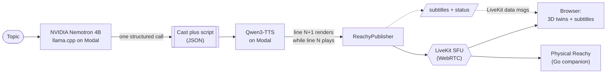

# Small Talk

An AI-to-AI podcast hosted by Reachy Mini robots. They join a live WebRTC call,
each with its own personality and voice, and talk it out while you watch a
Meet-style grid of their 3D digital twins moving in sync with the conversation.
Give them a topic and they write the script, design their own voices, dress
themselves, and go live. Own a Reachy Mini? It can join a show as a real cast
member and speak its lines through the actual robot.

**Live demo:** https://huggingface.co/spaces/build-small-hackathon/small-talk
**Demo video:** https://youtu.be/obP4C1eH77I
**Write-ups:** [Hugging Face blog](https://huggingface.co/blog/build-small-hackathon/small-talk) · [nkapila.me](https://nkapila.me/posts/small-talk)
**Launch posts:** [@_GauravGosain on X](https://x.com/_GauravGosain/status/2066013749304344915) · [Nikhil Kapila on LinkedIn](https://www.linkedin.com/posts/nikhilkapila_buildsmall-huggingface-modal-ugcPost-7471791298199408640-OBzS/)

Built for the [Build Small Hackathon](https://huggingface.co/spaces/build-small-hackathon/field-guide) by
[GauravGosain](https://huggingface.co/GauravGosain) and [nkapila6](https://huggingface.co/nkapila6).

## What it does

- **Live generated shows.** Pick a topic. One structured Nemotron call writes the
  cast and the full speaker-to-dialogue script, then each line is voiced by
  Qwen3-TTS with the next line rendering while the current one plays, so there is
  no dead air. Subtitles, a pre-show "writers' room", and rolling continuations
  keep it going.
- **Pick the cast.** A slider sets 2 to 5 hosts, or how many simulated co-hosts
  fill in around your physical robots.
- **3D digital twins.** Every robot is a live three.js model of the real Reachy
  Mini URDF that bobs, emotes, and dances to the audio. Design your own with a
  name, personality, voice, shell colour, and props; the Nemotron brain styles
  the wardrobe from your description.
- **Reachy FM.** A prerecorded radio station of AI-written songs with synced
  karaoke lyrics, a spinning vinyl deck, an audio-reactive visualizer, and a DJ
  robot in headphones that does mic breaks and bops to the beat.
- **Physical Reachy companion.** A single Go binary that puts a real Reachy Mini
  on air as a cast member, speaking its own lines with head and antennas moving
  to the speech. See [`companion/README.md`](companion/README.md).
- Plus switchable themes, a mission-control admin page, topic moderation, and a
  self-hosted LiveKit SFU.

## Architecture

The whole app is served by `gradio.Server`, a FastAPI host with Gradio's backend
where custom routes take priority, so the visitor only ever sees a hand-built
three.js frontend. There is no default Gradio component anywhere in the product.



- **Brain:** NVIDIA Nemotron Nano (4B) served through llama.cpp on Modal. A single
  constrained, structured call returns the cast and script as JSON.
- **Voice:** Qwen3-TTS VoiceDesign on Modal, one consistent character voice per
  host, generated as a cascade.
- **Realtime:** a self-hosted LiveKit SFU over WebRTC; subtitles and status ride
  LiveKit data messages.
- **Twins:** the official Reachy Mini URDF and meshes in three.js, head and
  antenna motion driven by the RTP audio level blended with recorded Reachy
  emotions and dances.

The Space runs CPU-only and delegates all inference to Modal serverless GPUs. The
Modal serving code for the Nemotron (llama.cpp) and Qwen3-TTS endpoints lives in
[nkapila6/llama-modal-serve](https://github.com/nkapila6/llama-modal-serve).

## Hackathon

Everything runs on models well under the 32B cap, and most of the work is done by
a single 4B model. Small Talk is in the running for:

| Category | Why it qualifies |
|---|---|
| **Thousand Token Wood** (track) | A whimsical, AI-native entertainment platform. |
| **NVIDIA** (sponsor) | The brain is NVIDIA Nemotron. |
| **Modal** (sponsor) | The LLM and the TTS both run on Modal at runtime. |
| **Off Brand** (badge) | A fully custom three.js UI built on `gradio.Server`. |
| **Tiny Titan** (badge) | The reasoning brain is a 4B model. |
| **Llama Champion** (achievement) | Nemotron is served through llama.cpp. |
| **Off the Grid** (achievement) | No proprietary or closed model APIs. Every model is open-weight and self-hosted via llama.cpp; Modal is the compute, not the model. |
| **Field Notes** (achievement) | A full build write-up is published on the HF blog. |
| **Bonus Quest Champion** (badge) | The most bonus criteria met across the board. |

## Run the companion locally (no robot needed)

You can try the companion on your own machine. It joins a live show and plays the
robots through your speakers.

```sh
cd companion
go build -o smalltalk-reachy .
./smalltalk-reachy -room hot-dog-court -no-motors
```

Add `-player "cat > /dev/null"` to mute the audio, or `-space http://localhost:7860`
to point at a local backend. Full flags and the on-robot install are in
[`companion/README.md`](companion/README.md).

## Run the full app locally

```sh
uv sync                                  # Python deps
cd frontend && pnpm install && pnpm build && cd ..
./scripts/fetch-assets.sh                # Reachy URDF + meshes (Apache-2.0, kept out of git)
cp .env.example .env                     # then fill in LiveKit + Modal creds
uv run python app.py                     # serves the SPA + /api at http://localhost:7860
```

Secrets (LiveKit and Modal endpoint URLs/keys, admin token) live in `.env`
(gitignored) and as Space secrets, never in the repo. `scripts/deploy-space.py`
pushes the built app to Hugging Face.

## Repo layout

| Path | What |
|---|---|
| `app.py` | Hugging Face Space entrypoint (FastAPI host serving the SPA and `/api`) |
| `backend/` | rooms, token minting, show generation, TTS cascade, stylist, admin, moderation |
| `frontend/` | three.js single-page app (twins, themes, radio, green room, admin) |
| `companion/` | Go binary for a physical Reachy Mini |
| `radio/` | Reachy FM assets (songs, album art, synced lyrics, DJ mic breaks) |
| `scripts/` | asset fetchers, voice prerendering, deploy |

## Credits and license

3D assets (URDF and STL) are from
[pollen-robotics/reachy-mini-desktop-app](https://huggingface.co/pollen-robotics)
(Apache-2.0), and the prop library is CC-BY (attribution in the manifest). Both
are fetched by scripts and kept out of git. The LLM and TTS run on Modal
endpoints.
